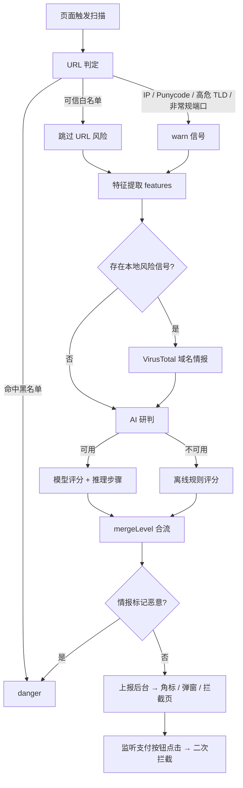

<div align="center">

# 净眼 · JingYan

**识别仿冒网址，以及页面里的充值、转账、支付等资金风险。**

`Manifest V3` · `零依赖` · `无构建步骤` · `规则引擎 + 大模型双通道` · `本地模型兜底`

</div>

---

反诈场景里，最危险的不是「看起来像钓鱼站」，而是**一个刚注册三天、域名和淘宝只差一个字母的页面，正对着你弹出「充值 888 元开通会员」**。传统黑名单追不上这种站，纯关键词规则又会在正规淘宝支付页误报。

净眼的思路是**分层判定**：先用本地规则做零成本初筛，再抽取结构化网页特征交给大模型（可指云端 API，也可指本机推理服务）做专家式推理，最后把「规则 / 特征 / 威胁情报 / 模型评分」合流成一个可解释的结论，并在你**点击付款按钮的那一瞬间**再拦一道。

不联网也能用：不填任何 Key 时，插件完全靠本地规则和离线评分运行，不会把页面内容发往任何第三方。

---

## ✨ 核心能力

| 能力 | 说明 |
| --- | --- |
| 仿冒域名黑名单 | 命中即判高危；支持子域名逐级上溯匹配 |
| 官方可信白名单 | 淘宝、支付宝、工行、建行、12306、政务 `gov.cn` 等，直接放行，压制误报 |
| URL 弱特征识别 | IP 直连、Punycode 国际化域名、高风险顶级域、非常规端口、子域名层级异常 |
| 品牌仿冒检测 | 域名里出现 `taobao` / `icbc` / `12306` 等品牌词但并非官方域名 → 硬信号 |
| 资金话术检测 | 资金词 + 动作词 + 金额三者共现，且金额与资金词邻近（≤120 字符）才算风险，避免「支付」二字满天飞就报警 |
| 大模型风险研判 | 输出 0–100 分、推理步骤、判断理由和安全建议，全过程流式回显 |
| 云端 / 本地双通道 | 地址与型号由你在设置页自选；云端不可用时自动兜底到本地 |
| 离线降级研判 | 没有任何模型可用时，用规则特征自建推理步骤与评分，功能不中断 |
| 威胁情报联动 | VirusTotal 域名信誉查询，24 小时本地缓存，仅在已有风险信号时才发起 |
| 支付动作拦截 | 监听「立即充值 / 确认支付 / 买入卖出」等按钮点击，做上下文二次判定 |
| 可解释提示 | 页面弹窗 + 角标 + 拦截页 + 弹窗详情，每条结论都附证据字段 |

---

## 🧭 检测结果分三档

| 档位 | 触发分数 | 表现 |
| --- | --- | --- |
| 🔴 **danger** 高危 | `score ≥ 70`，或命中黑名单，或威胁情报标记恶意 | 扩展角标变红 `!`，弹出高危拦截提示 |
| 🟡 **warn** 可疑 | `40 ≤ score < 70` | 角标橙色 `!`，弹出资金风险提示，可从拦截页选择「继续访问」，按 URL 记录 10 分钟放行窗口 |
| 🟢 **safe** 安全 | `score < 40` | 无角标，弹窗展示已通过的检查项 |

> 判定权重的细节见 [风险判定逻辑](#-风险判定逻辑)。

---

## 🚀 快速开始

### 1. 加载扩展到浏览器

```text
Chrome  → chrome://extensions
Edge    → edge://extensions
```

1. 打开右上角 **开发者模式**；
2. 点击 **加载已解压的扩展程序**；
3. 选择本仓库根目录（含 `manifest.json` 的那层）。

无需 `npm install`，没有构建步骤——克隆即用。

> Firefox 目前需要把 `manifest.json` 里的 `background.service_worker` 改为 `background.scripts` 数组后才能运行，插件本身未做 Firefox 适配。

### 2. 打开防护开关

**插件安装后防护默认是关闭的。** 点击工具栏图标，把顶部开关切到「已开启」，否则弹窗会一直显示「防护已暂停」。

这样设计是为了避免装完就在所有网页上静默执行检测。

### 3. （可选）配置大模型

点击弹窗右上角 ⚙ 进入设置页，任选一种：

- **填云端地址与凭证** → 接入你自选的兼容端点；
- **模型来源选 `local`** → 指向本机推理服务，页面内容不出机器；
- **全部留空** → 走离线降级研判，仍具备规则拦截能力。

设置页内置「测试云端连接 / 测试本地模型」按钮，保存前先验证一次。

### 4. （可选）启用 VirusTotal

设置页填入 VirusTotal API Key 即可。留空则该模块整体跳过，不产生任何额外请求。

---

## 🏗️ 检测流水线



### 触发与调度

- 内容脚本 `document_idle` 注入后先扫一次；
- `MutationObserver` + `input` / `change` 捕获 SPA 局部渲染，**500 ms 防抖、最长 3 s 强制触发**；
- 以 `location.href + 页面文本` 作为内容指纹，未变化不重复分析；
- 同一页面自动扫描冷却 **30 s**，手动「重新 AI 分析」可强制绕过。

---

## 🧠 风险判定逻辑

结论由 `mergeLevel()` 合流，优先级如下：

1. **黑名单**：`RISK_HOSTS` 命中 → 直接 `danger`，理由固定为「命中仿冒网站黑名单」。
2. **白名单**：`TRUSTED_HOSTS` 命中 → URL 侧不再产生风险，防止在正规电商支付页误报。
3. **弱特征**：IP 直连 / Punycode / 高风险 TLD / 非常规端口 → `warn`，多项命中会把中文理由拼进同一条提示。
4. **硬信号**：
   - `brandMismatch`：域名含品牌词但不是官方域名；
   - `credentialHarvest`：表单提交到跨站地址 **且** 页面存在密码输入框。
5. **资金判定**：资金词、动作词、金额三者共现，且资金词与金额距离 ≤ 120 字符（或金额本身带「保证金/手续费」等字样）；金额 ≥ `1000` 标记为大额。
6. **模型评分**：0–100 分，`≥70` danger、`≥40` warn，档位由系统统一换算，不信任模型自报的 level。
7. **情报覆盖**：VirusTotal `malicious ≥ 2` → 无条件升为 `danger`。

### 提示词里的评分纪律

`scripts/ai.js` 的 system prompt 显式约束了模型，这几条是压制幻觉的关键：

- 单一弱信号不得给到 70 分以上；
- 给到 70 分以上时，`reasons` 必须同时引用至少两类特征字段；
- `isOfficialBrand=true` 且无其他强信号时按安全处理；
- 不得编造特征数据里不存在的事实；
- 页面出现「充值/支付」且域名可信 → 属正常业务场景，不得高分。

---

## 📏 规则引擎

### 仿冒黑名单（节选）

```text
bankofchian.com     # 少一个 k
bank0fchina.com     # 数字 0 替换 o
icbcq.com           # 尾部加 q
taobao-vip.com      # 品牌词 + 后缀拼接
10086-10000.com     # 连字符伪装官方客服号
95588-ccb.com       # 冒用建行客服电话
```

匹配时按 `host` → 逐级剥离子域，`*.bank0fchina.com` 这类也能命中。

### 高风险顶级域

```text
.top .xyz .vip .club .tk .ml .ga .cf .gq .work .site .online
.live .shop .wang .icu .cyou .sbs .zip .review .country .loan
.win .download .racing .accountant .science .stream .gdn .bid
.trade .date .faith
```

### 文本特征词族

| 词族 | 覆盖 |
| --- | --- |
| `MONEY_RE` | 充值 / 转账 / 汇款 / 提现 / 收款码 / 银行卡 / 支付宝 / 微信支付 / USDT / 钱包 / 数字人民币 / 保证金 / 手续费 |
| `ACTION_RE` | 确认 / 提交 / 立即 / 下一步 / 账户 / 卡号 / 验证码 / 付款 / 支付 |
| `AMOUNT_RE` | 「充值金额 888 元」「￥1,200.00」「500 USDT」等，含中文数字后缀与货币符号 |
| `URGENT_RE_G` | 中奖 / 解冻 / 安全账户 / 账户异常 / 涉嫌违法 / 通缉 / 银保监 / 征信 / 清零 / 即将到期 / 否则 |
| `CONTACT_RE_G` | QQ / 微信 / Telegram / WhatsApp / 添加客服 / 扫码 / 加好友 / 进群 |
| `SENSITIVE_RE_G` | 身份证 / 银行卡号 / 密码 / 验证码 / CVV / 有效期 / 取款密码 |
| `COUNTDOWN_RE` | 剩余时间 / 倒计时 / 仅剩 / 秒后 / 即将关闭 / 马上失效 |

### 页面结构特征

表单数量、表单是否跨站提交、是否存在密码框、输入框总数、二维码图片数（按 `qr` / `erweima` / `收款码` 等 src/alt 识别）、iframe 来源、外链域名集合、meta description。

---

## 🤖 大模型集成

兼容任意 **OpenAI `/v1/chat/completions` 协议**的端点。插件不绑定任何模型厂商，文档里也不预设型号：云端与本地各一组「地址 + 模型名 + 凭证」，全部在设置页填写，留空即整条通道不调用。

`模型来源` 支持 `auto`（优先云端，失败回落本地）、`cloud`、`local` 三种模式。

### 结构化输出协议

模型先输出 `步骤1：…` 推理文本，再在 `<<<JSON>>>` 标记后给出结论。解析端做了平衡括号扫描 + 容错截断，因此流式输出过程中也能提前拿到可用的 JSON：

```json
{
  "score": 82,
  "summary": "仿冒工商银行域名，同时收集卡号与验证码",
  "steps": [
    { "title": "域名特征核对", "detail": "host 为 icbcq.com，与官方 icbc.com.cn 不一致", "risk": "high" }
  ],
  "reasons": ["url.brandMismatches 命中 icbc", "page.hasPasswordInput 为 true"],
  "suggestion": "立即停止操作，不要输入任何银行卡信息。"
}
```

### 可信域名快速通道

`analyzeRisk()` 对命中官方白名单的页面直接走本地快速分析，不发起云端请求——既避免在正规支付页多等几百毫秒，也防止模型被正常业务话术带偏。

### 离线降级

拿不到任何模型结果时，`buildLocalSteps()` 会直接用特征数据拼装推理步骤并给出评分，保证「没有网 / 没配 Key」时提示链路依然完整。

---

## 🔒 隐私与数据边界

这一节请如实了解：

- **不发** Cookie、密码框内容、浏览历史；采集文本时只取可见控件的 `textContent` / `value` / `placeholder`，并截断到 50000 字符。
- 页面内容**只会**发往你在设置页自行配置的模型端点。填第三方云端服务就意味着内容交给该服务商，填本机推理服务则完全不出机器——请据此评估。
- 凭证存于扩展本地存储，只用于请求你填写的那个地址。
- VirusTotal **只查询域名**，且仅在本地已产生风险信号时才发起，结果 24 小时本地缓存。
- 扩展无自有服务器、无埋点、无统计上报。
- `host_permissions: <all_urls>` 用于在任意页面执行检测。若你只想覆盖支付/电商场景，建议在装好后手动收窄该字段。

---

## 📁 项目结构

```text
.
├── manifest.json              # MV3 清单：权限、内容脚本注入顺序、service worker
├── config/extras.json         # 图标与 action 片段，供改写 manifest 时复用
├── icons/logo.png             # 扩展图标
├── popup/                     # 工具栏弹窗
│   ├── popup.html             # 开关、状态卡、AI 步骤卡、详情卡
│   ├── popup.js               # 拉取最近结果、渲染三态、触发重新分析
│   └── popup.css
├── pages/
│   ├── options.html|js        # 模型来源、云端/本地参数、VT Key、连接测试
│   ├── intercept.html         # 独立拦截页（web_accessible_resources）
│   └── warning.js             # 拦截页逻辑：读 url/level/host/evidence 参数，处理「继续访问」
├── scripts/                   # 内容脚本，按此顺序注入
│   ├── blacklist.js           # 黑名单 / 白名单 / 词族正则 / 全局阈值常量
│   ├── intel.js               # VirusTotal 查询，同一文件双端：service worker 直连，页面侧走消息代理
│   ├── core.js                # JINGYAN 主入口：checkUrl / checkMoneyText / analyzePage / mergeLevel
│   ├── features.js            # JINGYAN_FEATURES：URL、DOM、文本三类特征抽取与人类可读化
│   ├── modal.js               # 页面内提示弹窗（Shadow DOM 隔离样式）
│   ├── intercept.js           # 支付按钮点击拦截与上下文二次判定
│   ├── ai.js                  # JINGYAN_AI：配置缓存、prompt、流式解析、离线降级
│   ├── content.js             # 扫描调度、去重、冷却、跳转与放行记录
│   └── background.js          # service worker：角标、跨标签页状态、消息路由
└── else/                      # 早期单文件打包稿，非运行时依赖
```

### 消息通道

| 消息类型 | 方向 | 用途 |
| --- | --- | --- |
| `JINGYAN_PAGE_RISK` | content → bg | 上报页面风险，驱动角标 |
| `JINGYAN_GET_LAST_RESULT` | popup → bg | 取当前标签页最近一次结果 |
| `JINGYAN_GET_RISK` | popup → content | 主动要求重新扫描，可带 `force` |
| `JINGYAN_GET_SNAPSHOT` | popup → content | 取当前 URL / 标题 / 文本 |
| `JINGYAN_PROTECTION_CHANGED` | popup → content | 防护开关变更，立即重置状态 |
| `JINGYAN_INTEL_QUERY` | content → bg | 代理 VT 查询，绕开页面 CSP |
| `JINGYAN_NAVIGATE` | content → bg | 跳转到扩展内拦截页 |

---

## ⚙️ 配置项

所有配置都在弹窗右上角 ⚙ 设置页完成，只保存在扩展本地存储，不写文件、不上传。

| 设置项 | 作用 | 备注 |
| --- | --- | --- |
| 防护总开关 | 全局启用 / 停用检测 | **安装后默认关闭**，需手动打开 |
| 模型来源 | `auto` / `cloud` / `local` | `auto` 优先云端，失败回落本地 |
| 云端地址与模型 | 任意兼容 OpenAI 协议的端点 | 留空则不调用云端 |
| 本地地址与模型 | 本机推理服务端点 | 页面内容不出机器 |
| 云端失败回落本地 | 兜底开关 | 默认开启 |
| 每个页面都自动 AI 分析 | 关闭后仅在规则命中时才调用模型 | 默认开启 |
| 威胁情报凭证 | 启用 VirusTotal 域名信誉查询 | 留空则整块跳过 |

> 模型名称、服务地址与厂商一律不预置、不推荐，按你实际接入的服务填写。凭证仅存在本机扩展存储中，只用于请求你填写的那个地址。

改完即生效（`storage.onChanged` 驱动缓存失效），用弹窗里的「重新 AI 分析」可立刻验证新配置。

### 关键常量

| 常量 | 值 | 位置 |
| --- | --- | --- |
| `RISK_SCORE_WARN` / `RISK_SCORE_DANGER` | 40 / 70 | `scripts/blacklist.js` |
| `LARGE_AMOUNT_THRESHOLD` | 1000 | `scripts/blacklist.js` |
| `MALICIOUS_THRESHOLD` | 2 家引擎 | `scripts/intel.js` |
| `API_TIMEOUT` | 25 s | `scripts/ai.js` |
| `SCAN_DEBOUNCE` / `SCAN_MAX_WAIT` | 500 ms / 3 s | `scripts/content.js` |
| `AUTO_SCAN_COOLDOWN` | 30 s | `scripts/content.js` |
| `YELLOW_BYPASS_TTL` | 10 min | `scripts/content.js` |
| `MAX_TEXT_LENGTH` / `MAX_CONTROLS` | 50000 / 400 | `scripts/core.js` / `scripts/content.js` |

---

## 🧪 本地调试

- `chrome://extensions` → 检查视图 → **Service Worker**，看后台日志；
- 页面控制台过滤 `[JINGYAN]`，可看到情报命中、缓存复用与 AI 失败降级原因；
- 改完代码点扩展卡片上的 **重新加载** ⟳，再刷新目标页面；
- 想快速验证规则链路，临时把某个域名加进 `scripts/blacklist.js` 的 `RISK_HOSTS` 即可看到红灯路径。

---

## ⚠️ 已知限制

- 判定基于**文本与结构特征**，对纯图片排版（把金额做成 banner）的仿冒页识别有限；仅按 src/alt 猜二维码，不做图像解码。
- 高度混淆的 JS 渲染页面可能在首帧拿不到完整文本，依赖 `MutationObserver` 补扫。
- 模型结论受所用模型能力影响明显，小模型容易在「可信域名 + 正常支付」上过度紧张——这也是白名单与评分纪律存在的原因。
- 黑名单与品牌表是静态维护的，需要持续更新；VT 依赖你自己的 Key 与配额。
- 这是一个**辅助提示工具**，不保证拦下所有诈骗，也不能替代国家反诈中心 App 与 96110 专线。

---

## 🩺 故障排查

| 现象 | 处理 |
| --- | --- |
| 弹窗一直显示「防护已暂停」 | 手动打开顶部开关，安装后默认关闭 |
| AI 区域长时间「分析中」后无结果 | 检查设置页 Key/地址，用「测试云端连接」验证；超时上限 25 s |
| 本地模型连不上 | 确认本机推理服务已启动、目标模型已拉取，并放开了跨域限制 |
| 正规网站频繁弹黄条 | 把你的常用域名补进 `TRUSTED_HOSTS`，或关闭「每个页面都自动执行 AI 分析」 |
| 没有配置任何 Key 却仍出结果 | 属预期：走的是离线规则降级评分 |
| 提示弹窗被页面样式打乱 | 弹窗已在 Shadow DOM 内，若仍冲突请附页面 URL 提 issue |

---

## 🗺️ Roadmap

- [ ] 规则与黑名单改为远程热更新 + 本地兜底
- [ ] 二维码图像解码与收款主体核对
- [ ] 聊天记录 / 短信截图的本地识别
- [ ] 误报反馈闭环，允许用户一键标注并把样本导出为本地规则
- [ ] 更多浏览器与移动端 WebView 适配

---

## 🙏 致谢

模型侧不绑定任何厂商，可自由接入兼容 OpenAI 协议的云端或本地推理服务；域名信誉数据来自 VirusTotal。

## 📄 许可证

尚未指定。发布前请补充 `LICENSE`。

---

<div align="center">

**遇到可疑资金操作，先停手。** 域名差一个字母，钱就回不来了。

</div>
